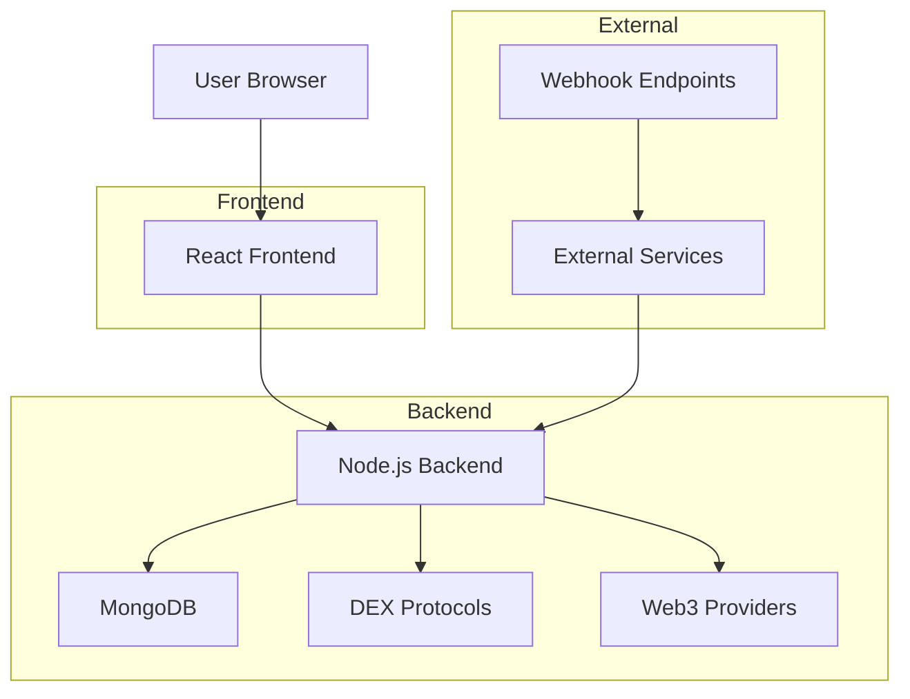
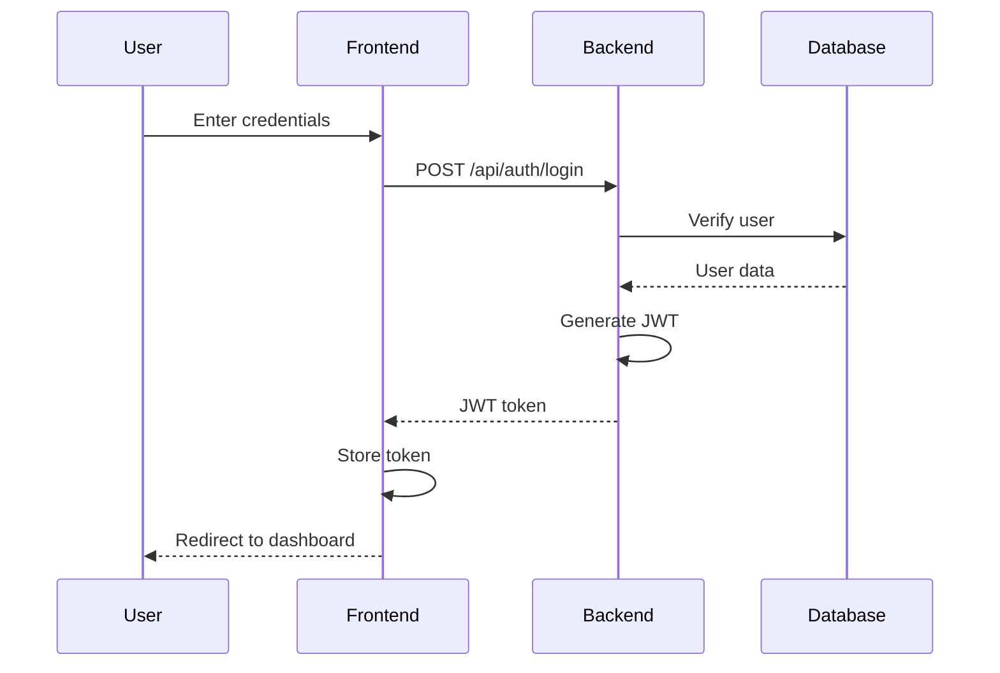
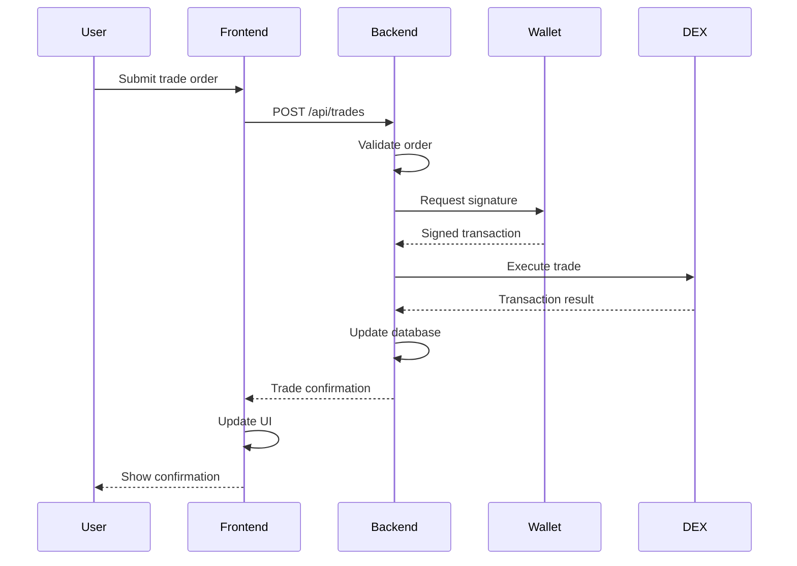
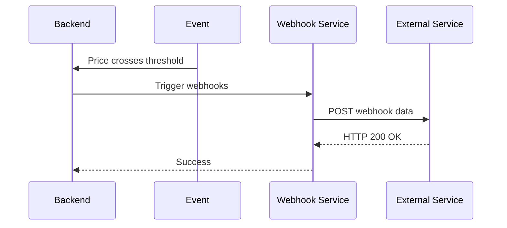

# System Architecture

## Overview

The DEX TradingView Clone consists of a React frontend and a Node.js backend, with MongoDB for data storage and Web3 integration for blockchain interactions.



## Frontend Architecture

The frontend is built with React and follows a component-based architecture:

```
src/
├── components/
│   ├── Navbar.jsx
│   ├── Dashboard.jsx
│   ├── ChartView.jsx
│   ├── TradePanel.jsx
│   ├── WebhookManager.jsx
│   ├── MarketOverview.jsx
│   └── RecentTrades.jsx
├── assets/
├── utils/
├── hooks/
├── styles/
└── App.jsx
```

## Backend Architecture

The backend follows a modular architecture with clear separation of concerns:

```
src/
├── server.js          # Entry point
├── controllers/       # Request handlers
├── models/            # Database models
├── routes/            # API routes
├── services/          # Business logic
├── middleware/        # Custom middleware
├── utils/             # Utility functions
└── config/            # Configuration files
```

## Data Flow

1. **User Interaction**: User interacts with the React frontend
2. **API Requests**: Frontend makes REST API calls to the backend
3. **Business Logic**: Backend processes requests through controllers and services
4. **Data Storage**: Data is stored/retrieved from MongoDB
5. **Blockchain Interaction**: Backend communicates with DEX protocols via Web3
6. **Real-time Updates**: Socket.IO provides real-time updates to clients
7. **Webhook Notifications**: External services are notified via webhooks

## Component Interactions

### Authentication Flow


### Trading Flow


### Webhook Flow


## Scalability Considerations

### Horizontal Scaling
- Multiple backend instances behind a load balancer
- Database replication and sharding
- CDN for static assets
- Caching layer (Redis)

### Performance Optimization
- Database indexing
- API response caching
- Lazy loading of components
- Code splitting
- Image optimization

### Security Measures
- JWT-based authentication
- Rate limiting
- Input validation
- CORS configuration
- HTTPS enforcement
- Web3 transaction simulation

## Deployment Architecture

```
Internet
    ↓
Load Balancer
    ↓
┌─────────────┐    ┌─────────────┐
│ Frontend    │    │ Backend     │
│ (Vite)      │    │ (Node.js)   │
└─────────────┘    └─────────────┘
    ↓                    ↓
┌─────────────┐    ┌─────────────┐
│ CDN         │    │ MongoDB     │
│ (Static     │    │ (Database)  │
│ Assets)     │    └─────────────┘
└─────────────┘         ↓
                   ┌─────────────┐
                   │ Redis       │
                   │ (Cache)     │
                   └─────────────┘
```

## Monitoring and Logging

### Application Monitoring
- Response time tracking
- Error rate monitoring
- Database query performance
- API usage analytics

### Infrastructure Monitoring
- Server CPU/memory usage
- Network latency
- Database performance
- External service health

### Logging Strategy
- Structured logging (JSON format)
- Log levels (debug, info, warn, error)
- Log aggregation
- Log retention policies